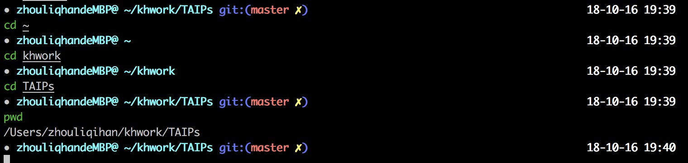
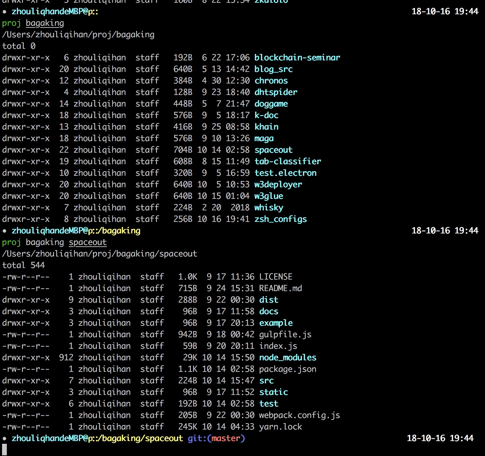
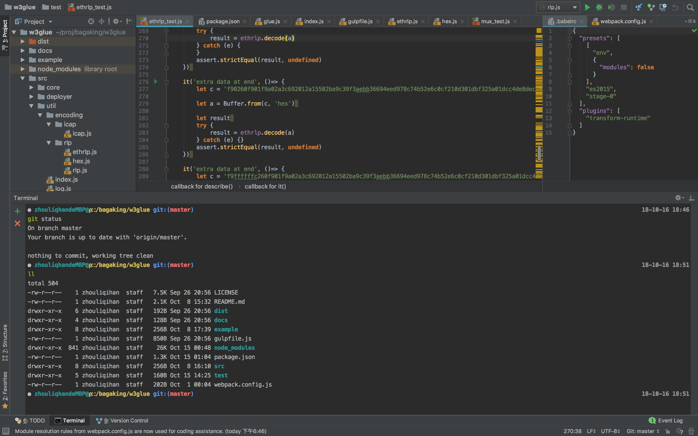

# ZSH Configs

my personal settin and theme of zsh

## Setup

1. install zsh first
2. put the file kh.zsh-theme into your ~/.oh-my-zsh/themes folder
3. immigrate settins in kh.zshrc.append.sh to your ~/.zshrc file
4. using commond `source ~/.zshrc` to reload the configs
5. enjoy it



## Commond 'proj'

you can using 'proj' commond to locate a project folder.

example:

```bash
proj #jump to the project folder
proj bagaking #jump to the account space (or 1st layer directory)
proj bagaking w3glue #jump to the repo space (or 2nd layer directory)
```

and if you using the kh.zsh-theme, project folder will be indicated.



### setting

you specify an folder such as /User/Me/Documents/Projects to system var named 'PROJPATH'

see [kh.zshrc.append.sh](kh.zshrc.append.sh)

## Compatibility

thanks for zsh, it can run very well in my terminals and text editors.

for example: in my jetbrain editor.
